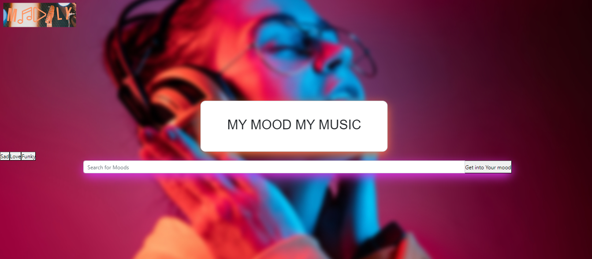

# Moodly

## :triangular_flag_on_post: TABLE OF CONTENT
- [Description](#-description)
- [Usage](#-usage)
- [Mock-up](#-mock-up)
- [Technology used](#-technology-used)
- [Installation](#-installation)
- [Credits](#-credits)
- [License](#-license)

## :book: DESCRIPTION
The main concept behind this Project (Moodly) is to enable our users to enhance or create a desired mood. This project helped us to combine our knowledge to crate an effective solution. We used our understanding of Bootstrap, JavaScript, React, Node.js, Escalidraw, Whimsical sometimes working in different branches in pairs to merge and resolve conflicts.

This app works as a mood enhancer by using music as a therapeutic tool. The user inputs any one of the moods provided on the list, then the user is provided with a series of playlists and genres that can help them to either relive a mood, create a mood or enhance their mood.

## :computer: USAGE
The user inputs their current or desired mood, then the app provides a number of music playlists related to that mood.

### :speech_balloon: User story
I wake up feeling depressed, I go to my office where I will have to fake a smile. One of the things that makes me happy is music but I don't know how to make a good playlist for myself. I want an application that's going to provide intuitive music choices that will make me feel better every morning before I go to work. I want to listen to the playlist whilst getting ready for work and driving in my car. PS: I hate listening to the same songs all the time so I want an app that can create a series of playlists automatically.

## :wrench: TECHNOLOGY USED
- HTML, CSS & Bootstrap Framework
- JavaScript & jQuery Library
- Spotify API & Quotable API
- React-Spotify-Widget
- React & Node.js
- MUI, Framer, Framer-motion, Motion, Axios, Bootstrap for React

### :bulb: What we’ve learnt
- Learning new features and new ways of coding from our teammates
- Working as a team remotely (agile methods) and brainstorming for efficient programming
- Working together to incorporate more than 2 technologies
- Deploying a responsive website that functions as intended

### Suggestions for improvement
+ Using an API that generates or streams a series of music artists according to a selected mood and providing information on their upcoming events
+ Merging the music API with a music concert API that shares concert details
+ Using an API that generates music videos for a better user experience

# user Instructions

Click on the link below to load Moodly in your browser

https://lucky-tulumba-fcee3b.netlify.app

## :speech_balloon: CREDITS
- This project was created as part of a coding assignment with [Trilogy Education Services](https://skillsforlife.edx.org/?utm_source=govuk)

## Collaborators:

[Noah Ojo](https://github.com/Kaystringscode)
[Amdlat Jinadu](https://github.com/amdalat1000000)
[Popoola Mary](https://github.com/olamaryse)
[Femi Adekunle](https://github.com/phemyx1)

## :scroll: LICENSE
This repository is licensed under the MIT license.
